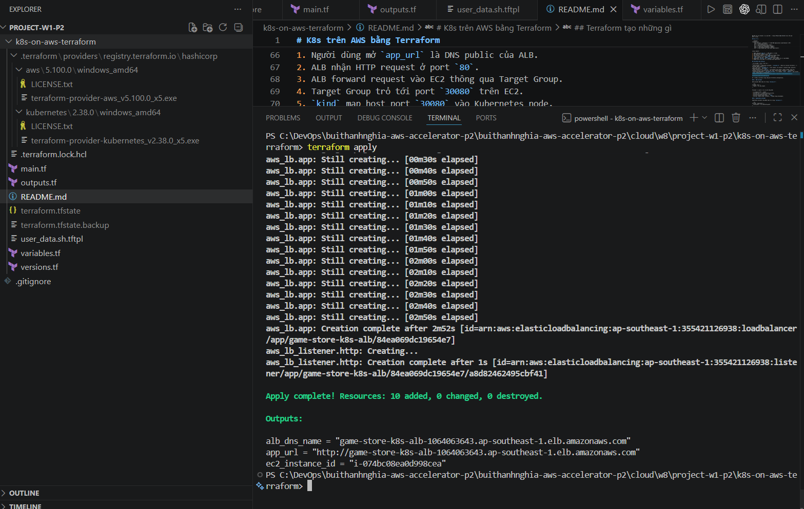
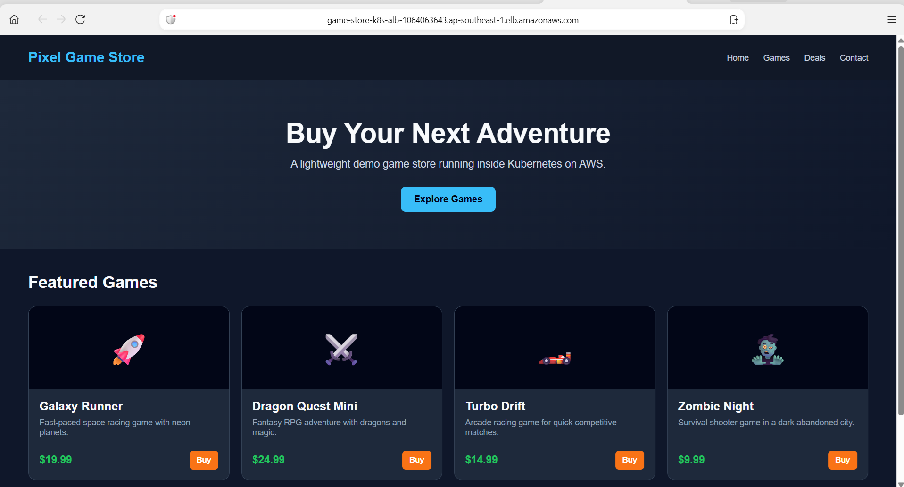
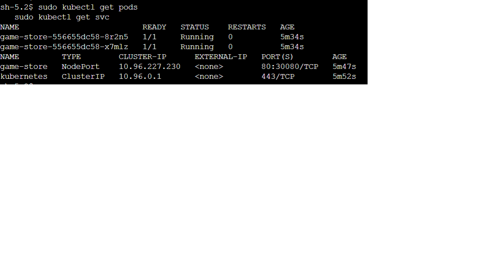
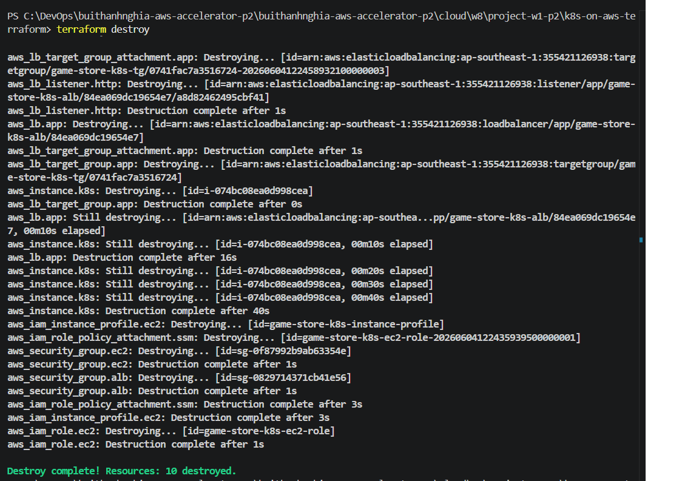

# K8s trên AWS bằng Terraform

Repo này dùng Terraform để dựng EC2, chạy cụm Kubernetes bằng `kind` trên EC2, deploy app
demo **Pixel Game Store** vào Kubernetes và public app ra Internet qua **AWS ALB**.

Mục tiêu bài lab:

- Một lệnh từ repo sạch để dựng hạ tầng và deploy app.
- App chạy trong Kubernetes, không cài trực tiếp lên EC2.
- Người dùng truy cập app qua URL public của ALB.
- Có wire tối thiểu 2 Terraform provider: `aws` và `kubernetes`.
- Có bằng chứng browser, Kubernetes và lệnh destroy.

## Chạy nhanh

Yêu cầu:

- Terraform `>= 1.6.0`
- AWS credentials đã cấu hình trên máy local
- AWS account có quyền tạo EC2, IAM, Security Group, ALB và Target Group
- Region có default VPC với ít nhất 2 subnet

Region mặc định: `ap-southeast-1`.

Từ thư mục repo này, chạy một dòng:

```powershell
terraform init; if ($LASTEXITCODE -eq 0) { terraform apply -auto-approve }
```

Lấy URL app:

```powershell
terraform output -raw app_url
```

Mở URL đó trên browser. Kết quả đạt là trang **Pixel Game Store** hiển thị qua DNS của ALB.

## Kiến trúc

```mermaid
flowchart LR
    %% =======================
    %% Pixel Game Store Architecture
    %% =======================

    User["User Browser<br/>Access website over HTTP"] -->|HTTP :80| ALB

    subgraph AWS["AWS Cloud"]
        subgraph Public["Public Entry Layer"]
            ALB["Application Load Balancer<br/>Listener: HTTP :80<br/>Security Group: allow inbound :80"]
            TG["Target Group<br/>Target type: EC2 instance<br/>Forward traffic to NodePort :30080<br/>Health check: HTTP"]
        end

        ALB -->|Forward request| TG

        subgraph Compute["EC2 Compute Layer"]
            EC2["EC2 Instance<br/>Amazon Linux 2023<br/>Docker + kind + kubectl<br/>Security Group: allow ALB to :30080"]

            TG -->|HTTP :30080| EC2

            subgraph Kind["kind Kubernetes Cluster running inside EC2"]
                Node["kind worker/control-plane node<br/>Container-based Kubernetes node"]

                SVC["Kubernetes Service<br/>Type: NodePort<br/>Service port: 80<br/>NodePort: 30080"]

                Deploy["Deployment<br/>nginx / Pixel Game Store<br/>desired replicas: multiple pods"]

                Pod1["Pod 1<br/>NGINX serves Pixel Game Store"]
                Pod2["Pod 2<br/>NGINX serves Pixel Game Store"]

                Node --> SVC
                SVC -->|Load balances inside cluster| Deploy
                Deploy --> Pod1
                Deploy --> Pod2
            end

            EC2 -->|NodePort maps host traffic into cluster| Node
        end
    end

    %% Styling
    classDef user fill:#ffffff,stroke:#1f2937,stroke-width:2px,color:#111827;
    classDef aws fill:#eef6ff,stroke:#2563eb,stroke-width:2px,color:#111827;
    classDef entry fill:#e0f2fe,stroke:#0284c7,stroke-width:2px,color:#0f172a;
    classDef compute fill:#fff7ed,stroke:#ea580c,stroke-width:2px,color:#111827;
    classDef k8s fill:#eef2ff,stroke:#4f46e5,stroke-width:2px,color:#111827;
    classDef pod fill:#ecfdf5,stroke:#16a34a,stroke-width:2px,color:#111827;

    class User user;
    class ALB,TG entry;
    class EC2 compute;
    class Node,SVC,Deploy k8s;
    class Pod1,Pod2,Pod3 pod;
```



Luồng request:

1. User mở `app_url`, là DNS public của ALB.
2. ALB nhận HTTP request ở port `80`.
3. Target Group forward request vào EC2 port `30080`.
4. `kind` map host port `30080` vào Kubernetes node.
5. Kubernetes `Service NodePort` route request tới pod NGINX đang serve Pixel Game Store.

## Terraform tạo gì

| Thành phần | File | Vai trò |
| --- | --- | --- |
| Provider | `versions.tf` | Khai báo `aws` và `kubernetes` provider. |
| Biến | `variables.tf` | Region, project name, instance type, app port, kubeconfig path và tag chung. |
| AWS infra | `main.tf` | Lookup default VPC/subnet, tạo IAM, Security Group, EC2, ALB, Target Group, Listener. |
| App | `app/` | Static HTML app và Dockerfile. |
| K8s manifest | `k8s/game-store.yaml.tftpl` | `Deployment` và `Service NodePort` cho app. |
| Bootstrap | `user_data.sh.tftpl` | Cài Docker/kind/kubectl, tạo cluster, build image, load image và deploy app vào K8s. |
| K8s provider proof | `kubernetes.tf` | ConfigMap opt-in để chứng minh Kubernetes provider có resource thật khi kubeconfig reachable. |
| Output | `outputs.tf` | Xuất `alb_dns_name`, `app_url`, `ec2_instance_id`. |

## Provider được wire như thế nào

Repo dùng 2 provider trong cùng Terraform configuration.

### AWS provider

```hcl
provider "aws" {
  region = var.aws_region
}
```

Chọn `aws` provider vì toàn bộ hạ tầng ngoài Kubernetes nằm trên AWS: EC2, IAM, Security
Group, ALB, Target Group, Listener và attachment. Đây là provider chính, trực tiếp tạo tài
nguyên khi chạy `terraform apply`.

### Kubernetes provider

```hcl
provider "kubernetes" {
  config_path = var.kubeconfig_path
}
```

Chọn thêm `kubernetes` provider để đáp ứng yêu cầu wire provider thứ hai và để chứng minh Terraform
có thể quản lý resource trong Kubernetes khi có kubeconfig truy cập được. Resource chứng minh nằm ở
`kubernetes.tf`:

```hcl
resource "kubernetes_config_map_v1" "provider_wire_proof" {
  count = var.enable_kubernetes_provider_resource ? 1 : 0
}
```

Mặc định `enable_kubernetes_provider_resource = false`, nên Kubernetes provider **chưa tạo gì trong
luồng deploy EC2 kind mặc định**. Lý do là cluster `kind` được tạo bên trong EC2 bằng `user_data`
sau khi Terraform đã tạo EC2. Máy local chạy Terraform không tự có kubeconfig/API endpoint reachable
của cluster `kind` nằm trong EC2, nên nếu bắt provider này deploy `Deployment`/`Service` ngay trong
luồng chính thì bài sẽ mất tính một lệnh và dễ lỗi vì phụ thuộc SSH tunnel hoặc copy kubeconfig thủ
công.

Vì vậy thiết kế hiện tại tách rõ:

- `aws` provider tạo hạ tầng AWS.
- EC2 bootstrap tạo `kind` và dùng `kubectl` trong chính EC2 để deploy app vào Kubernetes.
- `kubernetes` provider được wire sẵn và có resource opt-in để bật khi `kubeconfig_path` trỏ tới
  một cluster reachable.

## Vì sao chọn thiết kế này

- `kind` trên một EC2 rẻ và nhẹ hơn EKS, phù hợp bài lab.
- ALB cho URL public ổn định hơn so với gọi thẳng public IP của EC2.
- EC2 chỉ là host chạy Docker/kind; app thật sự nằm trong pod Kubernetes.
- NodePort `30080` là điểm nối đơn giản giữa ALB Target Group và Service trong cluster.
- Terraform quản lý toàn bộ AWS resource nên có thể destroy sạch sau khi demo.

## Kiểm chứng sau deploy

Lấy URL:

```powershell
terraform output -raw app_url
```

Gọi thử ALB:

```powershell
curl.exe (terraform output -raw app_url)
```

Kết quả đạt:

- Browser mở được trang **Pixel Game Store**.
- `curl` trả về HTML của Pixel Game Store.
- ALB Target Group healthy sau vài phút.

Kiểm tra app chạy trong Kubernetes qua SSM Session Manager vào EC2:

```bash
sudo kubectl get nodes
sudo kubectl get pods
sudo kubectl get svc
```

Kết quả mong đợi:

```text
NAME         TYPE       CLUSTER-IP      EXTERNAL-IP   PORT(S)
game-store   NodePort   ...             <none>        80:30080/TCP
```

Xem log bootstrap nếu cần debug:

```bash
sudo tail -n 100 /var/log/user-data.log
```

## Bằng chứng nộp bài

Khi nộp bài, chụp ảnh hoặc quay clip các bước sau:

1. Chạy lệnh:

   ```powershell
   terraform init; if ($LASTEXITCODE -eq 0) { terraform apply -auto-approve }
   ```

2. Chạy:

   ```powershell
   terraform output -raw app_url
   ```

3. Mở URL ALB trên browser và thấy trang **Pixel Game Store**.

4. Kiểm tra app nằm trong Kubernetes:

   ```bash
   sudo kubectl get pods
   sudo kubectl get svc
   ```

5. Sau khi chấm hoặc demo xong, chạy destroy:

   ```powershell
   terraform destroy -auto-approve
   ```

## Hình minh chứng

### Hình 1 - Lệnh Terraform chạy thành công



*Ghi chú: Ảnh này chứng minh repo chạy được từ đầu bằng `terraform init` và
`terraform apply -auto-approve`, không cần thao tác thủ công trên AWS Console.*

### Hình 2 - Output URL của ALB


*Ghi chú: Ảnh này chứng minh Terraform đã tạo ALB và xuất ra URL public thông
qua output `app_url`.*

### Hình 3 - Mở được ứng dụng trên browser



*Ghi chú: Ảnh này chứng minh URL ALB mở được trang Pixel Game Store trên browser.*

### Hình 4 - App chạy trong Kubernetes



*Ghi chú: Ảnh này chứng minh app không chạy trực tiếp trên EC2 mà chạy trong
Kubernetes dưới dạng pod và được expose bằng Service NodePort.*

### Hình 5 - Destroy dọn sạch tài nguyên



*Ghi chú: Ảnh này chứng minh đã chạy `terraform destroy -auto-approve` sau khi
demo để dọn sạch tài nguyên AWS và tránh phát sinh chi phí.*

## Destroy

Sau khi demo xong:

```powershell
terraform destroy -auto-approve
```

Lệnh này xóa các tài nguyên AWS do Terraform tạo: EC2, IAM role/instance profile, Security Group,
ALB, Target Group, Listener và Target Group Attachment.
